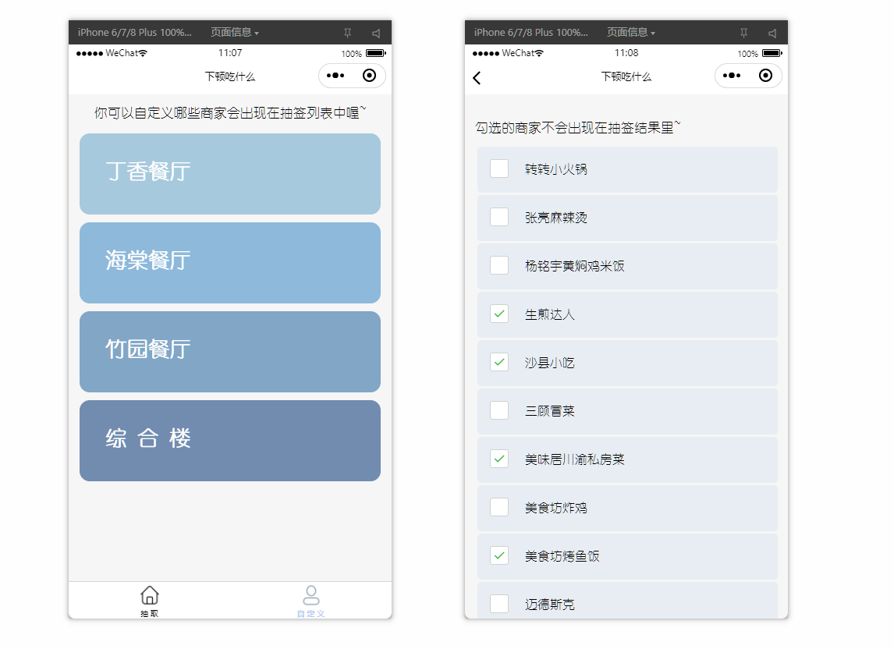

# What-to-Eat-Next-Time

该小程序旨在为我校师生的 “下一顿吃什么” 问题提供一个参考建议。通过抽取的设计，可以在一众商家列表中选出一家商家供以参考。

## 功能概述

作为一款以解决吃什么为卖点的小程序，首要的功能自然是帮助用户解决吃什么。因此，整个小程序最重要的功能就是抽取系统的设计。在当前版本中，抽取的设计还较为较基础，采用随机抽取的原则，对符合条件的商家中进行抽取。后序改进中，可以考虑加入口碑评价系统，或是用户偏好系统，做到具有对不同用户有不同权重的推荐，满足千人千面的口味需求。

其次，为了满足校内师生中，大家的住宿区各不相同，且相距较远，特意设立了**可以从不同区域的商家中选择一个或多个区域的商家添加入抽取列表。**此举可以方便用户就近就餐，或是选择自己想去的位置进行就餐。

再者，针对不同用户的口味不同问题，在选项页中，**用户可以对哪些商家会出现在抽取列表中进行个性化的修改和定制。**美中不足在于，修改目前还没有做到按用户信息进行保存，每次打开小程序需要重新进行设置。这也是下一次迭代中，首要进行改进。

通过多种功能的设计，小程序基本上可以解决校内师生选择就餐商家的问题。同时，提供了较为丰富的自定义选项，满足了不同人有不同的推荐清单。

## 详细介绍

作为一款轻量级的小程序产品，页面的审美和逻辑上都应该达到尽量的简约明了。为此，整个小程序的界面设计上，我们采用了一类简单但不失质感的蓝色系作为主色调。利用白色与不同的蓝色调配，使得整个小程序显得充满层次感得同时，对于重要功能的位置也不失醒目的提示。

### 首页

首页中，可以进行商家的抽取，以及为了方便不同住宿区的同学们选择就近的就餐地点，**设定了可以按丁香餐厅、竹园餐厅、海棠餐厅以及综合楼四个不同区域选定一个或多个特定区域的商家加入抽取列表中**，如下图。

通过勾选不同的餐厅区域，可以限定抽取列表中的商家范围，保证每位同学老师都可以在适合自己的就餐区域中选出合适的商家。

在首页，我们对主体功能“抽取吃什么”的按钮进行了高亮布置，白色背景下采用偏向浅紫的蓝色作为按钮的背景，一方面可以凸显出整个小程序的主体功能，另一个方面可以结合整体的色彩设计，做到风格上的同一。

同时，对于首页最大篇幅的位置，我们采用了与整体设计风格相配的可爱的颜文字形象来作为背景，同时该背景在抽取商家过程中以及抽取成功后还会变换不同的形态。

#### 选项页

考虑到老师同学们口味差异，存在特定不喜欢的商家，因此，在选项页中，点入不同餐厅的二级页面中，支持对餐厅中的所有商家进行自定义其是否在抽取列表中出现。对于口味对不上的商家，可以将其勾选。如下图。

选项页也沿用了蓝色作为整体的主题色，搭配不同层次的蓝色系，创造出了风格和谐又不单调的效果。

通过如上设置，可以确保每一位使用该小程序的师生，都可以尽可能选出自己心仪的商家进行就餐。

## 开发前瞻

- **每次都保存不同用户的个性化设置**

虽然已经实现了支持用户进行对哪些商家不出现个性化的设置，但这一信息仍然没有和用户本身关联起来。换句话来说，每次用户重新打开小程序，都需要重新在此进行个性化设置，这一点是比较不人性的。后续版本的更迭中，首要解决的就是这一问题。

实现起来也并不困难，思路大体为获取用户的登录 `uid`，关联 `uid` 与其对应的 `disableBusiness` 数组，将其存储至服务器端。每当用户再次登录时，将其从云端重新加载，即可做到保存用户个性化设置的效果。

- **引入商家评价功能**

开放用户对商家评价的功能，可以令用户自由对各个商家进行自己的评价。同时，在抽取到相应商家时，用户可以点进去进一步查看其他用户对该商家的评价，做到提供的就餐建议更有指导性、客观性。

- **抽取动画的改进**

进一步的，不仅仅通过按钮进行抽取，而是可以通话上下滑动这一更符合当代人操作习惯的操作来取代按钮的逻辑，实现更方便更美观的抽取效果。

